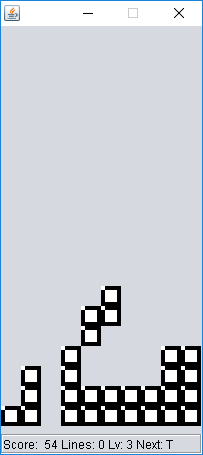

Tetris (single player)
=====================

The objective of [Tetris](https://en.wikipedia.org/wiki/Tetris) is to place as much falling tetrominoes as possible in a playing field without filling it. When an horizontal line is full, it's cleared from the field and lines above are shifted down, granting the player some points. Over time have been devised many variations of this game's mechanics.

This is a Java port of a small subset of the features implemented in <https://github.com/HashakGik/Tetris-C-sharp>:

- Only single player mode A is implemented
- The playing field uses a single bit for each block, so it's not possible to draw more than one kind of block.

Remarks
-------

- NetBeans makes it difficult to use a derived `JComponent` class inside a `JFrame` because it regenerates the frame every time, discarding some of the developer's edits: it's advised to edit `MainFrame.java` with a different editor/IDE
- This port won't be maintained.